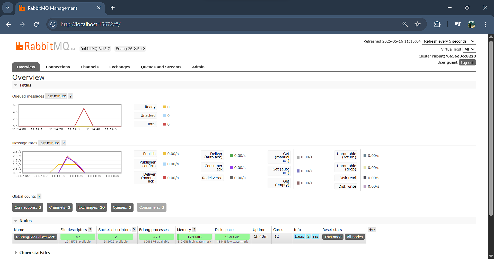

**Nama  : Nisrina Annaisha Sarnadi   
NPM   : 2306275960  
Kelas : B**

Reflection
---

### Tutorial A
1. **What is amqp?**   
   AMQP (Advanced Message Queuing Protocol) adalah protokol standar untuk komunikasi berbasis pesan yang digunakan dalam pesan untuk mengirim dan menerima pesan. Protokol ini memiliki fitur seperti antrian, routing, keandalan, dan keamanan. Biasanya digunakan dalam arsitektur microservices untuk memastikan komunikasi yang efisien antara layanan.  
2. **What does it mean? guest:guest@localhost:5672, what is the first guest, and what is the second guest, and what is localhost:5672 is for?**  
   Format guest:guest@localhost:5672 adalah URL koneksi ke broker AMQP, seperti RabbitMQ.
   Guest pertama adalah username yang digunakan untuk autentikasi, guest kedua adalah password yang digunakan untuk login, localhost menunjukkan bahwa broker AMQP berjalan di mesin lokal, dan 5672 adalah port default yang digunakan oleh AMQP untuk komunikasi.  

**Slow Subscriber**  
  
Total queue pada sistem mencapai 11 karena publisher dijalankan berulang kali dalam waktu singkat, menghasilkan 11 event `user_created`. Sementara itu, subscriber diperlambat dengan `thread::sleep(ten_millis)` selama 1 detik per pesan sehingga tidak mampu memproses pesan secepat publisher mengirimkannya. Akibatnya, pesan menumpuk di queue RabbitMQ hingga jumlahnya mencapai 11, sesuai dengan jumlah pesan yang belum diproses saat itu.

**Reflection**  

Terjadi penurunan spike message queue dibandingkan sebelumnya. Hal ini disebabkan oleh dijalankannya beberapa subscriber secara paralel, yang mempercepat pemrosesan pesan karena beban kerja terbagi. Antrean di RabbitMQ pun menurun lebih cepat dibandingkan saat hanya satu subscriber aktif. Setiap subscriber memproses pesan secara bersamaan, misalnya satu menangani “Budi” dan “Dira”, sementara yang lain memproses “Amir”, “Cica”, dan “Emir”. Ini mencerminkan prinsip skalabilitas dalam arsitektur event-driven, di mana menambah jumlah subscriber dapat mengurangi penumpukan antrean. Dari sisi kode, masih ada beberapa hal yang bisa ditingkatkan, seperti mengaktifkan durabilitas antrean agar pesan tidak hilang saat RabbitMQ restart, menghindari penggunaan `thread::sleep` yang blocking, serta menggantinya dengan pemrosesan asynchronous. Penambahan logging dan pengaturan nilai prefetch juga dapat membantu mendistribusikan pesan lebih merata dan menjaga performa sistem saat beban tinggi.